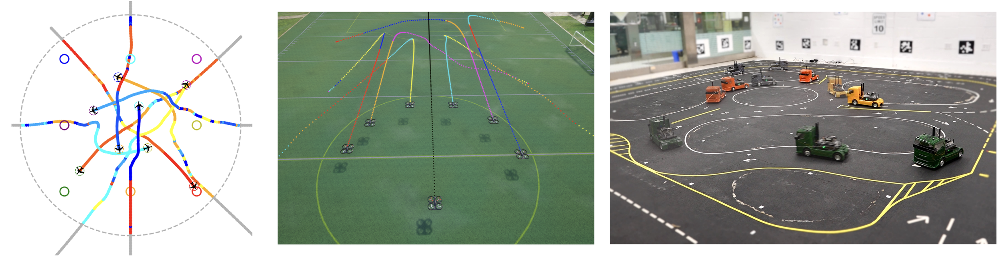
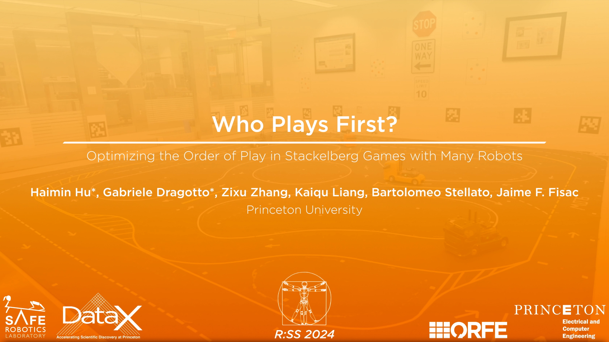

# Who Plays First? Optimizing the Order of Play in Stackelberg Games with Many Robots

[![License][license-shield]][license-url]
[](https://www.python.org/downloads/)
[![Website][homepage-shield]][homepage-url]
[![Paper][paper-shield]][paper-url]

[Haimin Hu](https://haiminhu.org/)<sup>1</sup>,
[Gabriele Dragotto](https://dragotto.net/)<sup>1</sup>,
[Zixu Zhang](https://zzx9636.github.io/),
[Kaiqu Liang](https://kaiquliang.github.io/),
[Bartolomeo Stellato](https://stellato.io/),
[Jaime F. Fisac](https://saferobotics.princeton.edu/jaime)

<sup>1</sup>equal contribution

Published as a conference paper at RSS'2024.


<!-- PROJECT LOGO -->
<br />
<p align="center">
  <a href="https://github.com/SafeRoboticsLab/Who_Plays_First">
    
  </a>
  <p align="center">
  </p>
</p>


<!-- TABLE OF CONTENTS -->
<details open="open">
  <summary><h2 style="display: inline-block">Table of Contents</h2></summary>
  <ol>
    <li><a href="#about-the-project">About The Project</a></li>
    <li><a href="#example">Example</a></li>
    <li><a href="#license">License</a></li>
    <li><a href="#contact">Contact</a></li>
    <li><a href="#citation">Citation</a></li>
  </ol>
</details>


<!-- ABOUT THE PROJECT -->
## About The Project

This repository implements **Branch and Play (B&P)**, an *efficient and exact* game-theoretic algorithm that provably converges to a *socially optimal* order of play and its Stackelberg (leader-follower) equilibrium.
As a subroutine for B&P, we also implement sequential trajectory planning (STP) as a game solver to scalably compute a valid local Stackelberg equilibrium for any given order of play.
The repository is primarily developed and maintained by [Haimin Hu](https://haiminhu.org/) and [Gabriele Dragotto](https://dragotto.net/).

Click to watch our spotlight video:
[](https://haiminhu.org/wp-content/uploads/2024/06/rss_wpf.mp4)


## Example
We provide an air traffic control (ATC) example in the [Notebook](https://github.com/SafeRoboticsLab/Who_Plays_First/blob/main/examples/STP/example.ipynb).
This Notebook comprises three sections, each dedicated to a closed-loop simulation using a different method: Branch and Play, first-come-first-served baseline, and Nash ILQ Game baseline.


<!-- LICENSE -->
## License

Distributed under the MIT License. See `LICENSE` for more information.


<!-- CONTACT -->
## Contact

- Haimin Hu - [@HaiminHu](https://x.com/HaiminHu) - haiminh@princeton.edu
- Gabriele Dragotto - [@GabrieleDrag8](https://x.com/GabrieleDrag8) - hello@dragotto.net


<!-- PAPER -->
## Citation

If you found this repository helpful, please consider citing our paper.

```tex
@inproceedings{hu2024plays,
  title={Who Plays First? Optimizing the Order of Play in Stackelberg Games with Many Robots},
  author={Hu, Haimin and Dragotto, Gabriele and Zhang, Zixu and Liang, Kaiqu and Stellato, Bartolomeo and Fisac, Jaime F},
  booktitle={Proceedings of Robotics: Science and Systems},
  year={2024}
}
```


<!-- MARKDOWN LINKS & IMAGES -->
<!-- https://www.markdownguide.org/basic-syntax/#reference-style-links -->
[license-shield]: https://img.shields.io/badge/License-MIT-blue.svg
[license-url]: https://opensource.org/licenses/MIT
[homepage-shield]: https://img.shields.io/badge/-Website-orange
[homepage-url]: https://saferobotics.princeton.edu/research/who-plays-first
[paper-shield]: https://img.shields.io/badge/-Paper-green
[paper-url]: https://arxiv.org/abs/2402.09246
